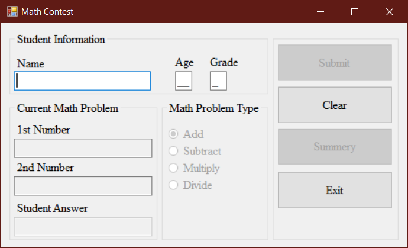
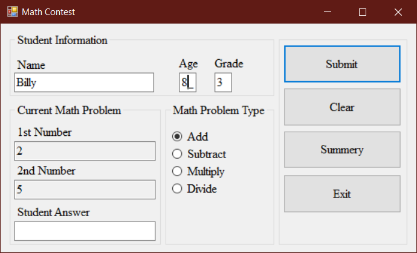
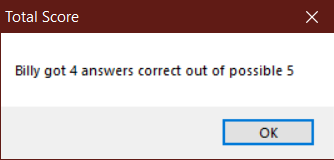

# Math Contest

## Project Setup

See [Project Setup Instructions](./ProjectSetup.md) for detailed steps on how to set up your C# project and version control for this assignment.

---

## Assignment Instructions

Create a Windows Forms application to host a math contest for children. Your form should allow the teacher to:

- Enter the child's name, grade (1-4), and age (7-11)
- Choose a math problem type (add, subtract, multiply, divide) using radio buttons (add selected by default)
- Validate all required information. Change the textbox color  to light yellow for missing/incorrect fields
- Lock the Submit button until all required fields are filled in correctly
- Lock the Summary button until the Submit button has been clicked at least once
- If the clear button is clicked, reset all fields to their default state
- If any of the student information fields are changed reset the summary to its default state and consider it a new student
- Generate new random numbers for each problem or whenever the problem type is changed
- Do not allow the user to enter their own numbers
- Allow the contestant to enter their answer and submit
- Show a congratulations message if correct, or the correct answer if not
- Keep a total of correct/incorrect responses for the current student and show a summary when requested

Refer to the example images for layout and formatting:

Remember to include the standard program information header in your code.

---

When complete, push your code to your GitHub repository and submit the link as instructed.
