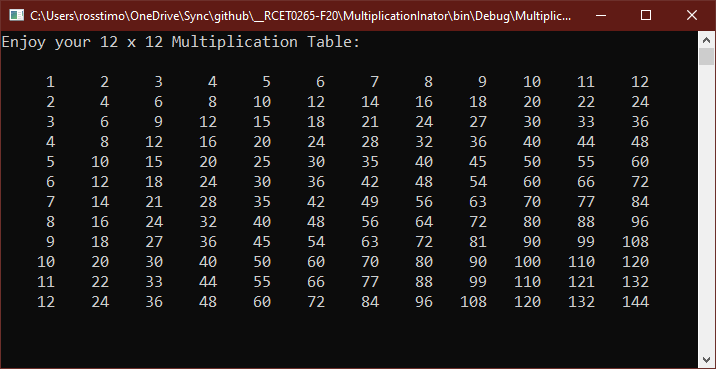
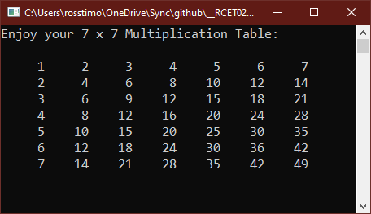

# Multiplication Table

## Project Setup

1. Create a new C# project named **MultiplicationTable**.
2. Initialize a new git repository in your project directory.
3. Create a remote repository on GitHub and link it to your local repository.
4. Make an initial commit with your project files and push to GitHub.
5. Add the standard program information header to your code. For example, your header should include:
   - Your name
   - Course number
   - Semester
   - Program name
   - Repository URL
6. Commit the header addition and push to GitHub.
7. Commit your changes periodically and at appropriate milestones as you work on your code.

---

## Assignment Instructions

Create a program that displays a multiplication table for numbers 1 through 12. Your program should:

1. Use nested loops to generate and display the multiplication table.
2. Format the output so the table is easy to read and **aligned**.
3. Optionally, allow the user to specify the size of the table (default to 12x12 if not specified).
4. Wait for the user to press Enter before closing the console window.
5. Remember to include the standard program information header in your code.

---

### Example Output

See the following example images for reference:

---

When complete, push your code to your GitHub repository and submit the link as instructed.
