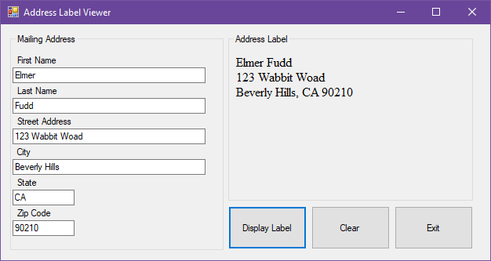

# Address Label

## Project Setup

See [Project Setup Instructions](./ProjectSetup.md) for detailed steps on how to set up your C# project and version control for this assignment.

---

## Assignment Instructions

Create a Windows Forms application to display a properly formatted mailing label. Your form should include:

- Text boxes for: First Name, Last Name, Street Address, City, State, Zip
- Group all text box fields in a group box
- Buttons: Display, Clear, Exit
- Properly named controls (e.g., FirstNameTextBox, DisplayButton, etc.)
- Display the formatted address in a label when the Display button is clicked
- Clear all fields with the Clear button
- Exit the application with the Exit button

Refer to the example image for layout and formatting:

Remember to include the standard program information header in your code.

---

When complete, push your code to your GitHub repository and submit the link as instructed.
