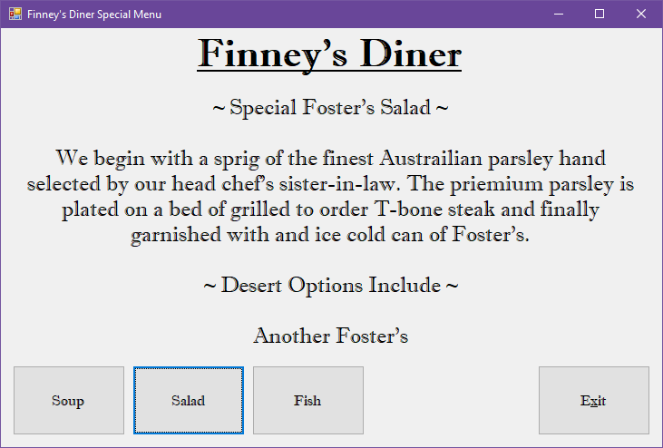

# Diner Menu

## Project Setup

See [Project Setup Instructions](./ProjectSetup.md) for detailed steps on how to set up your C# project and version control for this assignment.

---

## Assignment Instructions

Create a Windows Forms application to display the daily specials for your diner. Your form should include:

- A label at the top with your diner's name
- Buttons to display: Soup of the Day, Chef's Special, Daily Fish
- A label to display the appropriate special depending on the button pressed
- Properly named controls (e.g., SoupButton, SaladButton, FishButton, ExitButton, DinerNameLabel, DisplaySpecialLabel)
- Exit button to close the application

Refer to the example images for layout and formatting:

Remember to include the standard program information header in your code.

---

When complete, push your code to your GitHub repository and submit the link as instructed.
