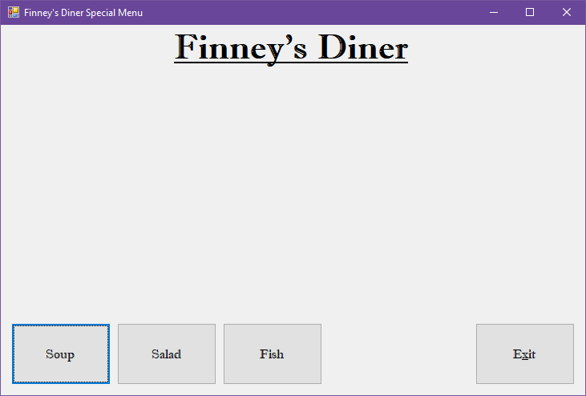
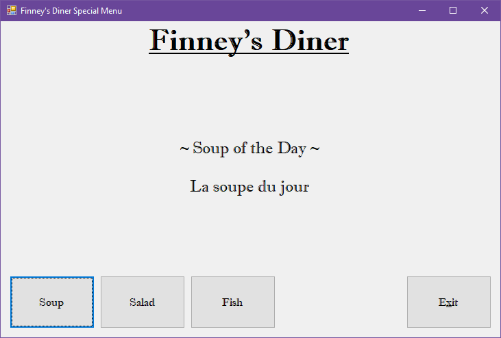
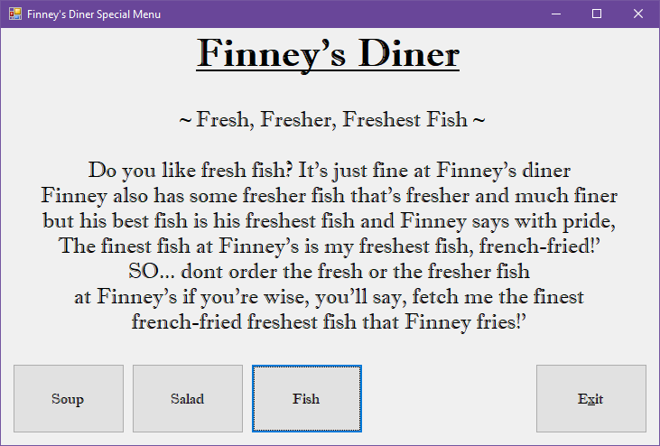

# Diner Menu

## Project Setup

1. Create a new C# Windows Forms project named **DinerMenu**.
2. Initialize a new git repository in your project directory.
3. Create a remote repository on GitHub and link it to your local repository.
4. Make an initial commit with your project files and push to GitHub.
5. Add the standard program information header to your code. For example, your header should include:
   - Your name
   - Course number
   - Semester
   - Program name
   - Repository URL
6. Commit the header addition and push to GitHub.
7. Commit your changes periodically and at appropriate milestones as you work on your code.

---

## Assignment Instructions

Create a Windows Forms application to display the daily specials for your diner. Your form should include:

- A label at the top with your diner's name
- Buttons to display: Soup of the Day, Chef's Special, Daily Fish
- A label to display the appropriate special depending on the button pressed
- Properly named controls (e.g., SoupButton, SaladButton, FishButton, ExitButton, DinerNameLabel, DisplaySpecialLabel)
- Exit button to close the application

Refer to the example images for layout and formatting:

Remember to include the standard program information header in your code.

---

When complete, push your code to your GitHub repository and submit the link as instructed.
