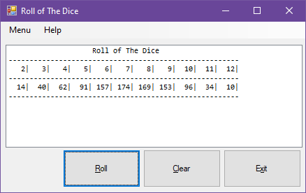

# Roll of the Dice - List Box

## Project Setup

1. Create a new C# Windows Forms project named **RollOfTheDiceListBox**.
2. Initialize a new git repository in your project directory.
3. Create a remote repository on GitHub and link it to your local repository.
4. Make an initial commit with your project files and push to GitHub.
5. Add the standard program information header to your code. For example, your header should include:
   - Your name
   - Course number
   - Semester
   - Program name
   - Repository URL
6. Commit the header addition and push to GitHub.
7. Commit your changes periodically and at appropriate milestones as you work on your code.

---

## Assignment Instructions

Write a program that rolls **two** six-sided dice 1,000 times and accumulates the count of each number rolled efficiently in an array.

- Display the results in a list box with formatted columns and headers.
- The header row should show the roll result numbers 2 to 12.
- The data row should show the total count of how many times each number came up.

Refer to the example image for layout and formatting:

Remember to include the standard program information header in your code.

---

When complete, push your code to your GitHub repository and submit the link as instructed.
