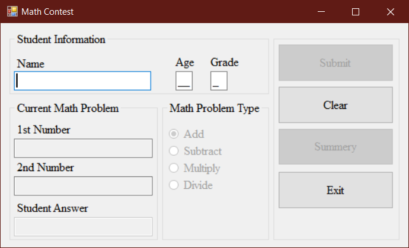
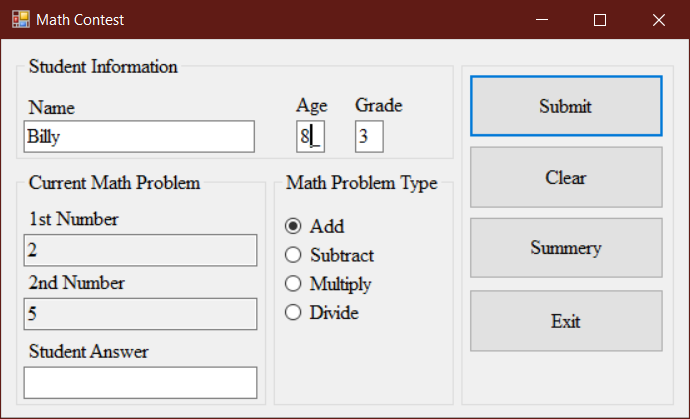
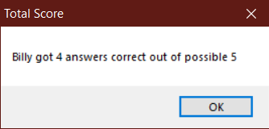

# Math Contest

## Project Setup

1. Create a new C# Windows Forms project named **MathContest**.
2. Initialize a new git repository in your project directory.
3. Create a remote repository on GitHub and link it to your local repository.
4. Make an initial commit with your project files and push to GitHub.
5. Add the standard program information header to your code. For example, your header should include:
   - Your name
   - Course number
   - Semester
   - Program name
   - Repository URL
6. Commit the header addition and push to GitHub.
7. Commit your changes periodically and at appropriate milestones as you work on your code.

---

## Assignment Instructions

Create a Windows Forms application to host a math contest for children. Your form should allow the teacher to:

- Enter the child's name, grade (1-4), and age (7-11)
- Choose a math problem type (add, subtract, multiply, divide) using radio buttons (add selected by default)
- Validate all required information. Change the textbox color  to light yellow for missing/incorrect fields
- Lock the Submit button until all required fields are filled in correctly
- Lock the Summary button until the Submit button has been clicked at least once
- If the clear button is clicked, reset all fields to their default state
- If any of the student information fields are changed reset the summary to its default state and consider it a new student
- Generate new random numbers for each problem or whenever the problem type is changed
- Do not allow the user to enter their own numbers
- Allow the contestant to enter their answer and submit
- Show a congratulations message if correct, or the correct answer if not
- Keep a total of correct/incorrect responses for the current student and show a summary when requested

Refer to the example images for layout and formatting:

Remember to include the standard program information header in your code.

---

When complete, push your code to your GitHub repository and submit the link as instructed.
