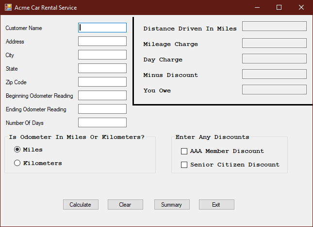
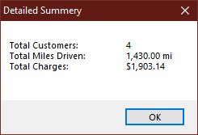

# Car Rental

## Project Setup

1. Create a new C# Windows Forms project named **CarRental**.
2. Initialize a new git repository in your project directory.
3. Create a remote repository on GitHub and link it to your local repository.
4. Make an initial commit with your project files and push to GitHub.
5. Add the standard program information header to your code. For example, your header should include:
   - Your name
   - Course number
   - Semester
   - Program name
   - Repository URL
6. Commit the header addition and push to GitHub.
7. Commit your changes periodically and at appropriate milestones as you work on your code.

---

## Program Requirements

[Hint: Create a flow chart for each section using a tool like draw.io]

### Input Validation

1. Include input validation for all text boxes.
2. Remove the invalid data from any affected text box.
3. Set the focus to the first affected text box in the tab order.
4. Validate customer information:
   - No field can be left blank.
5. Validate the odometer readings:
   - Beginning odometer reading must be less than ending odometer reading.
6. Validate number of days:
   - Days must be greater than zero.
   - Days cannot be greater than 45.
8. Do not perform any calculations unless all input is valid.
9. Use a single message box to display any improper input.
10. Do not display the message box until the calculate button is clicked.

### Calculations

1. The daily charge is $15.00 per day.
2. Mileage Charge:
   - First 200 miles driven are always free.
   - All miles between 201 and 500 inclusive are $0.12 per mile.
   - Miles greater than 500 are charged at $0.10 per mile.
3. All calculations must use miles:
   - Use the radio buttons to determine if the odometer value is in miles or kilometers.
   - 1 Kilometer equals 0.62 Miles.
   - If readings are in kilometers, convert them to miles for the output display and when performing your calculations (**DO NOT** modify the text in the odometer text box).
   - Do not make any calculations or conversions until the calculate button is clicked.
4. Use the check boxes for AAA Member and Senior Citizen:
   - AAA members receive a 5% discount.
   - Senior citizens get a 3% discount.
   - A person can receive both discounts.
   - Do not take the discount until the calculate button is clicked.
5. Each calculation or conversion (e.g., daily charge, mileage charge, discounts, kilometers to miles) should be implemented as a small, specific function in your code. This improves readability, maintainability, and testability.

#### Example: Kilometers to Miles Conversion

```csharp
// Converts kilometers to miles
private double KilometersToMiles(double kilometers)
{
    return kilometers * 0.62;
}
```

### Display the Output

1. All output should be properly formatted:
   - Display the customer’s distance driven in miles with “mi” suffix.
   - Display the customer’s total mileage charge formatted as currency.
   - Display the customer’s total daily charge formatted as currency.
   - Display the customer’s total discount applied formatted as currency.
   - Display the customer’s total charges formatted as currency.

### Summary

1. Include a summary button to display all totals:
   - This summary button should be disabled until at least one rental has been completed.
2. Display the following summary using a message box:
   - Total number of customers.
   - Total distance driven in miles.
   - Total charges.
3. Perform all “Clearing the Form” actions.
4. Do not clear the summary totals.

### Clearing the Form

1. When the clear button is clicked:
   - Clear all input text boxes.
   - Clear all output text boxes.
   - Clear discount check boxes.
   - Select the miles radio button.
2. Do not clear the summary totals.

### Closing Program

1. When the user clicks the exit button:
   - Prompt the user with Yes/No buttons in a message box.
   - Ask if they are sure they want to exit.
2. Do not exit unless the user clicks the yes button.

---

### User Interface Example

Refer to the following images for the required user interface layout:




---


When complete, push your code to your GitHub repository and submit the link as instructed.
